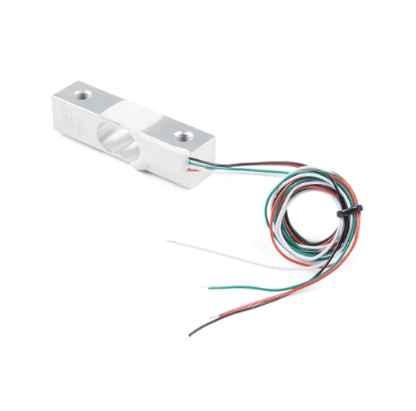
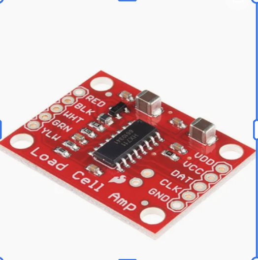
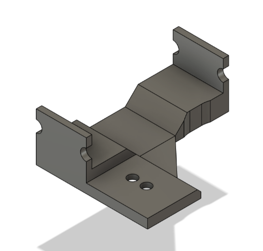

# Overview
We are using two implementations to "walk" Pupper with a leash. For the sensor implementation, we are using a custom ROS2 publisher and subscriber node to publish sensor readings from a Raspberry Pi Pico W and modifications to lab_6. The Raspberry Pi 4 from Pupper will be subscribed to this node. For the RL implemenation, we are will be adding to lab_5.

Slides: https://docs.google.com/presentation/d/1g2nzQHmxPXcY9-3Gn_u5153e9yrS_icvtOC-Yueb2_s/edit?usp=drive_link

Videos: https://drive.google.com/drive/folders/1_IHZBOSZvxqxb4rCNMoKzECx82MBmdct?usp=drive_link

# Sensor Implementation

# Changes to lab_6_fall_2025:
- Added files:
    - movement_subscriber.py (subscriber node logic)
    - read_data.py (publisher logic; print sensor data to terminal)
    - added movement_subscriber (line 108) and read_data (line 101) as nodes to lab_7.launch.py
    - run_sensors.sh (script to run launch, read_data.py, and movement_subscriber.py)
    - picoW-code (hold codes to be run on the Pico W)


NOTE: The logic in movement_subscriber.py was merged into read_data.py to allow for easier integration with ROS2. Used karel_realtime_commander.py as a template.


# ROS2 Configuration
To run testing on local env, ensure ROS2 is installed. Follow offical documentation: https://docs.ros.org/en/foxy/Installation.html

# Hardware





# Reinforcement Learning Implementation
For this project, we modified the existing code on robot. We added another monorepo and redeployed lab_5 with a new trained policy.


# To run sensor implementation
1) Download this repo and ensure ROS2 is installed on the machine you will be running the program on
2) Install the Pico W code on the Raspberry Pi Pico W
3) Run
    ```
    bash run_sensors.sh
    ```

# To run RL implementation
1) Run in a separate terminal
   ```
   python deploy.py
   ```
2) Run in a separate terminal
   ```
   ros2 control switch_controllers --activate neural_controller
   ```


